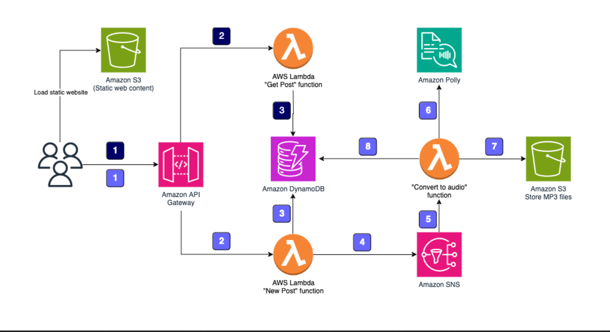

# **Multilingual Voice Synthesis Project Using AWS Services**

## **Overview**

This project demonstrates how to build a multilingual voice synthesis web application using various AWS services. Users can enter text, select a voice/language, and synthesize the text into speech. The application stores the synthesized voice in an Amazon S3 bucket and provides a downloadable link for playback. The project supports multiple languages and voices from different countries. Additionally, users can retrieve previously synthesized voices via unique post IDs stored in Amazon DynamoDB.

## **AWS Services Used**

1. **AWS Lambda**: Serverless function to handle text-to-speech (TTS) requests using Amazon Polly.
2. **Amazon Polly**: Converts text to speech using multiple voices and languages.
3. **Amazon S3**: Stores the MP3 files generated by Amazon Polly.
4. **Amazon API Gateway**: Serves as an interface between the front-end and Lambda functions.
5. **Amazon DynamoDB**: Stores post IDs, user inputs, and metadata for retrieving saved voice outputs.

## **Infrastructure**

The infrastructure of the project is provided below.

## **Features**

- **Multilingual Voice Synthesis**: The project supports various voices from Amazon Polly, such as:
  - Joanna (English)
  - Maja (Polish)
  - Enrique (Spanish)
  - Mizuki (Japanese)
  - Marlene (German)
  - and more ...
  
- **Text-to-Speech Conversion**: Users can input text, select a language, and get an MP3 file of the synthesized voice.

- **Post ID Search**: Users can input a post ID to retrieve previously synthesized MP3 files.

## **Prerequisites**

1. **AWS Account**: Ensure you have an AWS account to create Lambda functions, API Gateway, S3 buckets, and DynamoDB tables.
2. **Amazon Polly Service Access**: You need access to Amazon Polly for text-to-speech conversion.
3. **Amazon S3**: Create an S3 bucket to store the synthesized MP3 files.
4. **Amazon DynamoDB**: Set up a table to store metadata (post ID, text, voice, status, and the generated MP3 URL).
5. **Amazon API Gateway**: Set up an API Gateway to trigger Lambda functions.

## **Setup**

### 1. **Clone the Repository**

### 2. **Lambda Functions**

#### **Text-to-Speech Lambda Function (`convert_to_speech.py`)**

This Lambda function receives the user’s text and voice selection, uses Amazon Polly to synthesize the text into speech, stores the MP3 file in an S3 bucket, and logs the data into a DynamoDB table.

- **Input**: JSON object containing `"text"` and `"voice"`.
- **Output**: Post ID and an MP3 URL.

#### **New post Function (`newpost.py`)**

This Lambda function makes the new MP3 file based on the text provided by the user.

#### **Get post Function (`getpost.py`)**

This Lambda function returns the  MP3 file based on the post ID provided by the user.

### 3. **Amazon S3 Bucket**

Create an S3 bucket and set permissions to allow the Lambda functions to upload and retrieve files. Ensure that public access settings allow you to download the MP3 files.

### 4. **DynamoDB Table**

Set up a DynamoDB table with the following attributes:
- `PostID` (Primary Key)
- `Text` (String)
- `Voice` (String)
- `Status` (String: e.g., 'Completed')
- `URL` (String: S3 URL of the MP3 file)

### 5. **API Gateway**

Set up an API Gateway with two endpoints:
- **POST** 
- **GET** 

### 6. **Front-End Setup**

The front-end consists of an HTML page with a text box for input, a dropdown for language/voice selection, and buttons for submitting and retrieving synthesized voices. The `index.html` file calls the respective API Gateway endpoints to submit text and retrieve MP3 files.

You can test the application locally by opening the `index.html` in your browser.

## **How to Use**

1. **Synthesizing Text to Speech**:
   - Enter the desired text.
   - Select the voice/language from the dropdown menu.
   - Click "Say it!" to synthesize the text. The resulting MP3 file will be displayed along with a post ID.
   
2. **Retrieve Previous Synthesized Speech**:
   - Enter the Post ID of a previously generated speech.
   - Click "Search" to retrieve and play the MP3 file.

## **Demo**

Five demo audio files in different languages are included in the `demos/` directory:

## **Screenshots**

Some screenshots of AWS infrastructure has been added in `screenshot-aws/` dicrectory:

## **Challenges & Considerations**

1. **Billing**: Using Amazon Polly, API Gateway, and S3 can incur AWS charges, especially if you process a large amount of text or store many MP3 files.
   
2. **Security**: Make sure to secure your Lambda functions, S3 buckets, and API Gateway endpoints to prevent unauthorized access.

## **Conclusion**

This project demonstrates how to integrate various AWS services to build a multilingual voice synthesis application. By leveraging serverless computing, cloud storage, and machine learning, the project provides a scalable and efficient solution for converting text into speech in multiple languages.
